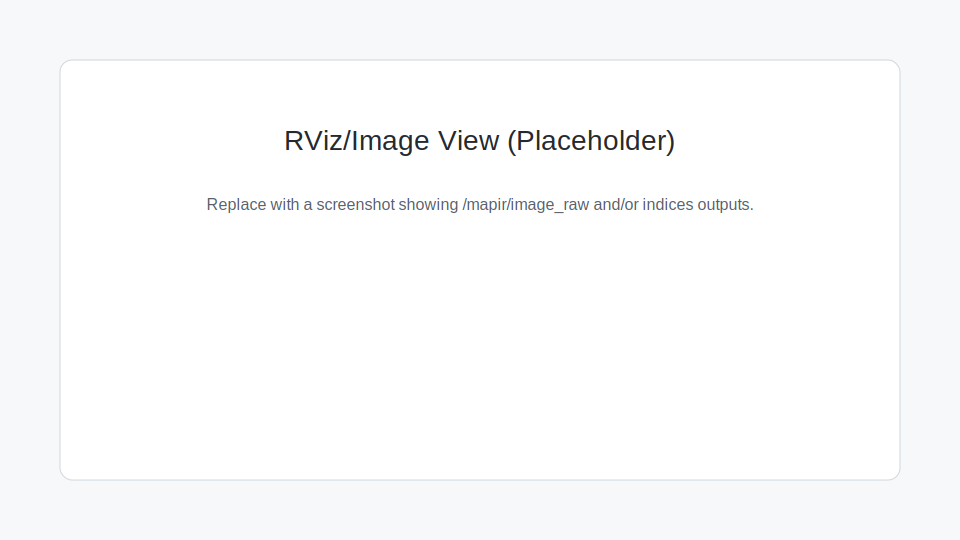

# Quickstart



## 1) Verify the camera is visible

```bash
v4l2-ctl --list-formats-ext -d /dev/video0
```

## 2) Build from source (colcon)

```bash
source /opt/ros/jazzy/setup.bash
colcon build --symlink-install
source install/setup.bash
```

## 3) Run the camera node (baseline 30 Hz)

Edit `config/mapir_camera_params.yaml` for your device and resolution, then:

```bash
ros2 launch mapir_camera_ros2 mapir_camera.launch.py \
  namespace:=mapir \
  camera_params_file:=$(ros2 pkg prefix mapir_camera_ros2)/share/mapir_camera_ros2/config/mapir_camera_params.yaml
```

GStreamer capture (optional):

- Put your custom pipeline in a copy of the params file under `gstreamer_pipeline`, or
- Run the node directly and override parameters:

```bash
ros2 run mapir_camera_ros2 camera_node --ros-args \
  -r __ns:=/mapir \
  -p use_gstreamer:=true \
  -p gstreamer_pipeline:="v4l2src device=/dev/video0 ! image/jpeg,width=1280,height=720,framerate=30/1 ! jpegdec ! videoconvert ! video/x-raw,format=BGR ! appsink drop=true max-buffers=1 sync=false"
```

Validate:

```bash
ros2 topic hz /mapir/image_raw
ros2 topic echo --once /mapir/image_raw --field header
```

## 4) Enable indices (RGN baseline)

```bash
ros2 launch mapir_camera_ros2 mapir_camera.launch.py \
  namespace:=mapir \
  enable_indices:=true
```
For real-time performance, keep the indices list to 1-2 entries.

## 5) Enable indices (Survey3W OCN)

```bash
ros2 launch mapir_camera_ros2 mapir_camera.launch.py \
  namespace:=mapir \
  enable_indices:=true \
  indices_params_file:=$(ros2 pkg prefix mapir_camera_ros2)/share/mapir_camera_ros2/config/mapir_indices_params.yaml
```

## 6) Visualize

- RViz: add an Image display and select `/mapir/image_raw`.
  - If the image does not show, set the Image display QoS Reliability to
    `Best Effort` (matches the default publisher QoS).
  - Alternatively set `qos_best_effort: false` in the camera params file.
- Quick viewer:
  - `ros2 run image_tools showimage --ros-args -r image:=/mapir/image_raw`

## 7) Reflectance calibration (T4 target)

Capture the open T4 target so the ArUco marker and 2x2 panels are visible. The
T4-R50 layout (panel on the left, ArUco on the right) is the default in
`config/reflectance_ocn.yaml`:

```bash
ros2 launch mapir_camera_ros2 mapir_camera.launch.py \
  namespace:=mapir \
  enable_reflectance:=true \
  reflectance_params_file:=$(ros2 pkg prefix mapir_camera_ros2)/share/mapir_camera_ros2/config/reflectance_ocn.yaml
```

Tune `panel_scale_w`, `panel_scale_h`, `panel_gap_scale`, and
`patch_reflectances` in `config/reflectance_ocn.yaml` for your target.
