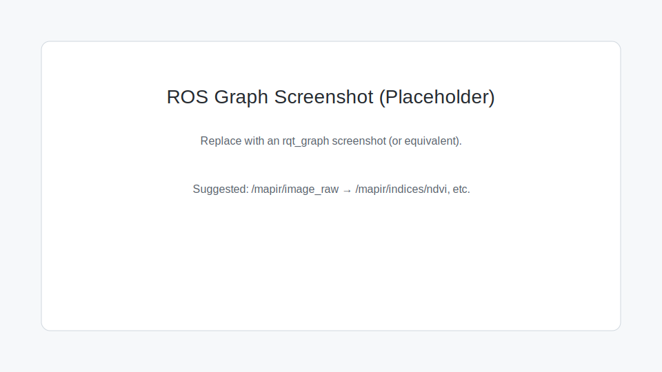

# ROS Contract

## Nodes

- `camera_node` (python entry: `mapir_camera_ros2.nodes.camera_node`)
- `camera_node_cpp` (C++ entry: `mapir_camera_ros2::camera_node_cpp`)
- `indices_node` (python entry: `mapir_camera_ros2.nodes.indices_node`)
- `reflectance_node` (python entry: `mapir_camera_ros2.nodes.reflectance_node`)

## Topics

All topics are relative to the namespace (launch default: `namespace:=mapir`).

| Topic | Type | Notes |
|---|---|---|
| `/<ns>/image_raw` | `sensor_msgs/Image` | Encoding `bgr8`. |
| `/<ns>/camera_info` | `sensor_msgs/CameraInfo` | Loaded via `camera_info_manager` if provided. |
| `/<ns>/indices/<index>` | `sensor_msgs/Image` | Encoding `32FC1` (float32). |
| `/<ns>/indices_color/<index>` | `sensor_msgs/Image` | Optional; encoding `bgr8` (colormap). |
| `/<ns>/image_rect` | `sensor_msgs/Image` | Encoding `32FC3` (float32 reflectance; rectified when enabled). |
| `/<ns>/image_reflectance_preview` | `sensor_msgs/Image` | Optional; encoding `bgr8` or `mono8`. |
| `/<ns>/reflectance/debug` | `sensor_msgs/Image` | Optional; encoding `bgr8` (overlay). |
| `/<ns>/reflectance/status` | `std_msgs/String` | Optional; calibration status text. |

## Services

| Service | Type | Notes |
|---|---|---|
| `/<ns>/set_camera_info` | `sensor_msgs/srv/SetCameraInfo` | Supports `camera_calibration` tools. |

## QoS

- Default: BEST_EFFORT, depth 5 (camera-stream friendly; RViz compatible).

## Frames

- `frame_id` defaults to `mapir3_optical_frame` (REP-105 optical frame convention).

## Timestamps

- Frames are stamped using the node clock at publish time (not a hardware timestamp).

## Runtime Toggles

- `indices_node` supports a runtime `enabled` parameter:
  - `ros2 param set /<ns>/indices enabled false`
  - `ros2 param set /<ns>/indices enabled true`
