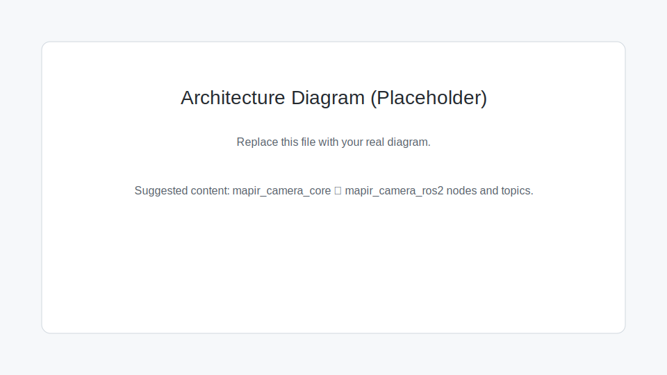

# Architecture



## Repository layout

- `mapir_camera_ros2/`: ROS-facing Python nodes (rclpy publishers/subscribers, parameters, QoS).
- `mapir_camera_ros2/`: Package sources, including Python nodes, scripts, and C++ sources.
- `mapir_camera_core/`: ROS-agnostic logic:
  - V4L2/OpenCV capture helpers (`v4l2_camera.py`)
  - multispectral index math (`spectral_indices.py`)
- `scripts/`: Python entrypoints installed as ROS executables.
- `launch/`, `config/`, `docs/`: launch files, parameters, and docs.

## Workspace best practices

- Keep source code organized in the `src/` directory of a ROS 2 workspace.
- Track source with Git; avoid committing `build/`, `install/`, or `log/`.
- Use separate workspaces for separate projects or development contexts.
- Use workspace overlays only when needed for multi-repo development.

## Package layout reference

This package follows the standard ROS 2 layout. Not every folder is required
for every package, but this is the recommended structure:

```
mapir_camera_ros2/
├── README.md
├── LICENSE
├── CMakeLists.txt
├── package.xml
├── config/
├── docs/
├── launch/
├── mapir_camera_ros2/
│   ├── __init__.py
│   ├── scripts/
│   ├── include/
│   └── src/
├── mapir_camera_core/
│   └── __init__.py
└── test/
```

## Data flow

1. `camera_node` captures frames from `/dev/video*` and publishes:
   - `/<ns>/image_raw` (`sensor_msgs/Image`)
   - `/<ns>/camera_info` (`sensor_msgs/CameraInfo`)
   - `/<ns>/metadata` (`std_msgs/String`, JSON; optional UVC metadata stream)
2. Optional `indices_node` subscribes to `/<ns>/image_raw` and publishes:
   - `/<ns>/indices/<index>` (`sensor_msgs/Image`, `32FC1`)

## Design intent

Keep ROS-independent processing in `mapir_camera_core` so it can be reused later
for non-ROS interfaces (e.g., HTTP SDK, file batch processing).
